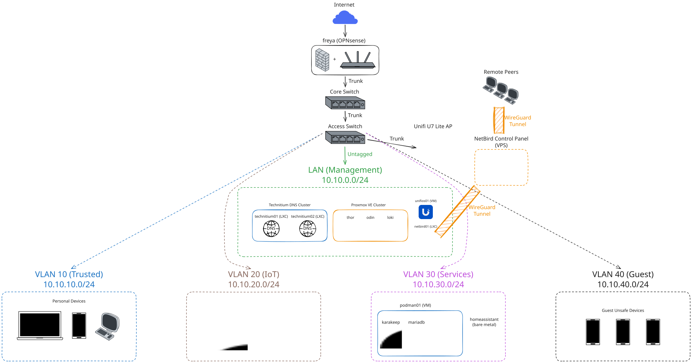

# Homelab

A three-node Proxmox cluster, a VLAN-segmented network, and the services running in the k3s cluster on top of them - built, broken, fixed, and documented.

<!-- Add once CI exists:

-->
[](LICENSE)

---

## Topology


> Written breakdown: [docs/network/topology.md](docs/network/topology.md)

---

## Hardware (Computing Nodes)

| Host | Hardware | Role |
|------|----------|------|
| `freya` | Lenovo ThinkCentre M920q | OPNsense firewall, VLAN routing |
| `thor` | Lenovo ThinkCentre M710q | Proxmox VE Node 1 |
| `odin` | Lenovo ThinkCentre M710q | Proxmox VE Node 2 |
| `loki` | Lenovo ThinkCentre M710q | Proxmox VE Node 3 |
| `homeassistant` | Home Assistant Green | Home Assistant OS host |

Mounted in a DeskPi Rackmate T2 12U 10" mini-rack. Full bill of materials with sources, prices and condition: [docs/hardware/](docs/hardware/README.md)

---

## Network

OPNsense handles routing and firewalling between segments. Each VLAN is a separate `/24` subnet, with inter-VLAN traffic denied by default and opened per rule.

| VLAN | Segment | Subnet | Notes |
|------|---------|--------|-------|
| untagged | Management | `10.10.0.0/24` | Switch and hypervisor management |
| 10 | Trusted | `10.10.10.0/24` | Personal workstations, laptops,  phones |
| 20 | IoT | `10.10.20.0/24` | Proxmox guests, self-hosted services |
| 30 | Services | `10.10.30.0/24` | Applications |
| 40 | Guest | `10.10.40.0/24` | Untrusted devices, isolated, internet only |

- **DNS:** 2-Node Technitium Cluster, each in a separate LXC, with query logging to MariaDB
- **Wireless:** Unifi U7 Lite, using PSSK for segmenting VLANs
- **Remote access:** NetBird VPN, no ports/services exposed to the internet
<!-- TODO: - **Monitoring:** TODO -->

Network Topology: [docs/network/topology.md](/docs/network/topology.md) | Inter-VLAN Rules: [docs/network/vlans.md](docs/network/vlans.md) | Configs: [network/](network/)

---

## Services

| Service | Host | VLAN | Deployment |
|---------|------|------|------------|
| OPNsense | freya | all | bare metal |
| Technitium DNS | x2 LXC on Proxmox | 30 | LXC |
| MariaDB | podman01 | 30 | Podman quadlet |
| Karakeep | podman01 | 30 | Podman quadlet, migrating to k3s |
| Home Assistant | homeassistant | 30 | bare metal |

Containers run rootless under Podman, managed as systemd units via quadlets. Guests are provisioned with Proxmox cloud-init and hardened with pubkey-only SSH, fail2ban, ufw and unattended-upgrades.

---

## Repo layout

```
.
├── docs/                  Diagrams, hardware BOM, decisions, runbooks, postmortems
├── network/               OPNsense, switch and Unifi configs 
├── infrastructure/        Proxmox cluster and k3s: the platform layer
├── apps/                  Manifests, quadlets, configs, notes
├── ansible/               Base hardening roles and playbooks
└── scripts/               Standalone automation
```

---

## Status

Actively built.

Current TODO List:
- [ ] Setup a k3s cluster on the Proxmox nodes
- [ ] Move MariaDB app inside the Technitium Cluster App
- [ ] Move Karakeep from Podman quadlet to Kubernetes
- [ ] Ansible roles for base hardening, replacing the manual cloud-init steps
- [ ] Terraform provider for declarative Proxmox VM management
- [ ] CI: yamllint, ansible-lint, shellcheck, gitleaks

---

## Secrets Management

No live credentials are committed. Config exports are sanitized, secrets are encrypted with SOPS where they need to be versioned, and every service folder ships a `.env.example`.

---

## License

MIT. See [LICENSE](LICENSE).
